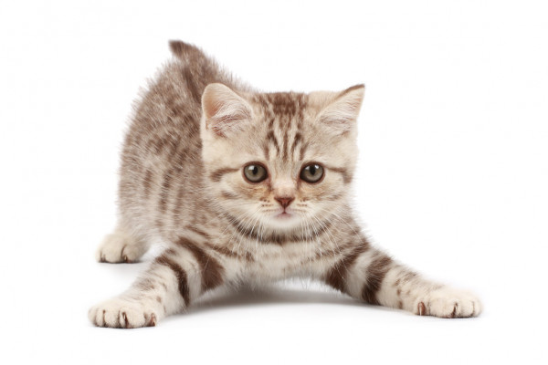

# `simsteg`
**Simple steganography** script for hiding files and messages in images.

## Why?
This program was made parially as a challange for OpenAI Codex, to measure the limits of the models knowledge.
The code has been rewritten and improved by hand to make the program as stable as possible.

### [Download latest](https://github.com/WilliamRagstad/simsteg/releases/latest/download/simsteg.py)

## Usage
```
> python simsteg.py -h  
usage: simsteg.py [-h] [-o OUTPUT] [-v] [-f FILE] [-t TEXT] [-d] input

A tool that takes an JPG or PNG image as input, hides some data in it and saves the new modified image.

positional arguments:
  input                 The input image file.

optional arguments:
  -h, --help            show this help message and exit
  -o OUTPUT, --output OUTPUT
                        The output image file to be created.
  -v, --verbose         Output more information about the process.
  -f FILE, --file FILE  The file to be hidden in the input image file.
  -t TEXT, --text TEXT  The text to be hidden in the input image file.
  -d, --decode          Decode the input image file.
```

## Examples

### Decode
```
> python simsteg.py image.png -d  
--- Text 1 Start ---
Hello, beautiful
world!
---- Text 1 End ----
The file 'nested_image.jpg' already exists. Do you want to overwrite it? (y/n): y
Successfully extracted file 'nested_image.jpg'! (119088 bytes)

Done decoding, 1 hidden text message(s) and 1 hidden file(s) were found.
```

### Encode
```
> python simsteg.py source.png -f nested.png -o dest.png
File was hidden in the image file. (130865 bytes)
The modified image was successfully saved to dest.png
```

## Your turn
Download the image of a kitten below together with the script from above.\
Your task is to decode the contents of this file.


